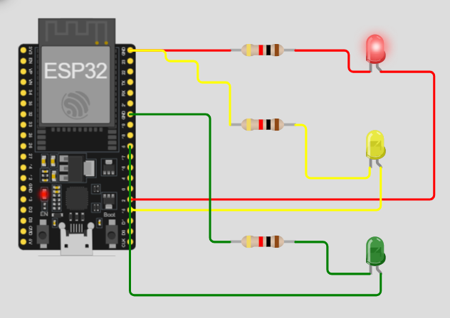

## Simulation Screenshot

## Description
Traffic light simulation using ESP32 on Wokwi with MicroPython.

The system controls 3 LEDs:
- Red LED
- Yellow LED
- Green LED

## Components
- ESP32 DevKit
- Red LED
- Yellow LED
- Green LED
- 3 Resistors 1KΩ
- Wokwi Simulator

## Pin Connections
| LED | ESP32 Pin |
|---|---|
| Red | GPIO 2 |
| Yellow | GPIO 4 |
| Green | GPIO 5 |

## Behavior
1. Red LED ON for 3 seconds
2. Yellow LED ON for 1 second
3. Green LED ON for 3 seconds
4. Yellow LED ON for 1 second
5. Repeat forever

## Files
- `main.py` - MicroPython traffic light code
- `diagram.json` - Wokwi circuit configuration

## Run
Open the project in Wokwi and start the simulation.

## Author
Ruth Cohen