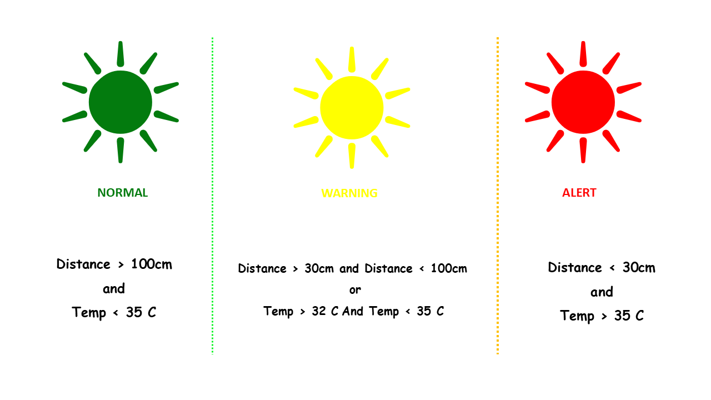
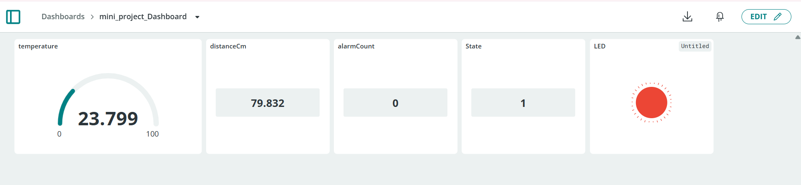

# Security Monitor Mini Project

## Project Overview

This project implements an IoT security monitoring system using an ESP32-C5 board.

The system monitors:

- Distance using an HC-SR04 ultrasonic sensor
- Temperature using a DHT22 sensor
- System state using a state machine
- Alarm count
- Online status

The project also sends data to Arduino IoT Cloud and sends an HTTP POST request when a new alert starts.

## Project Structure

```text
mini-project/
├── assets/
│   ├── dashboard_screenshot.png
│   ├── state_machine_diagram.png
├── final_code/
│   ├── arduino_secrets.h
│   ├── final_code.ino
│   └── thingProperties.h
├── starter_code/
│   └── starter_code.ino
├── wokwi/
│   ├── diagram.json
│   ├── libraries.txt
│   └── sketch.ino
└── README.md
```

## Main Version

The main project code is located in:

```text
final_code/final_code.ino
```

This version is intended for the real ESP32-C5 hardware and includes:

- Arduino IoT Cloud integration
- WiFi connection handling
- DHT22 temperature reading
- HC-SR04 distance reading
- State machine logic
- LED status indication
- HTTP POST alert reporting
- FreeRTOS tasks

## Wokwi Version

The Wokwi version is located in:

```text
wokwi/sketch.ino
```

Wokwi does not provide an ESP32-C5 board, so the simulation uses a regular ESP32 DevKit board.

Because of that, the GPIO pins in the Wokwi version are adapted to match the `diagram.json` file.

The Wokwi version is used only for simulation and demonstration of the project logic.

## Hardware Components

- ESP32-C5
- DHT22 temperature sensor
- HC-SR04 ultrasonic distance sensor
- Green LED
- Yellow LED
- Red LED
- Resistors
- WiFi connection

The Wokwi simulation also includes a buzzer.

## State Machine

The system has three states:

| State | Meaning |
|---|---|
| NORMAL | No risk detected |
| WARNING | Medium distance or temperature warning |
| ALERT | Critical distance or temperature detected |

### State Rules

```text
ALERT:
- distance > 0 and distance < 30 cm
- or temperature > 35°C

WARNING:
- distance between 30 and 100 cm
- or temperature between 32°C and 35°C

NORMAL:
- no warning or alert condition
```

When the system enters `ALERT` from another state, the alarm counter is increased.

## State Machine Diagram



## LED Behavior

| State | LED |
|---|---|
| NORMAL | Green LED |
| WARNING | Yellow LED |
| ALERT | Red LED |

## FreeRTOS Tasks

The final code uses FreeRTOS tasks:

| Task | Purpose |
|---|---|
| `sensorTask` | Reads DHT22 and HC-SR04 sensors |
| `alertTask` | Updates LEDs according to the current state |
| `displayTask` | Prints system data to Serial Monitor |
| `cloudTask` | Updates Arduino IoT Cloud variables and sends HTTP POST alerts |
| `wifiTask` | Monitors WiFi connection status |

## Arduino IoT Cloud Variables

The project uses the following Arduino Cloud variables:

| Variable | Type | Purpose |
|---|---|---|
| `temperature` | CloudTemperatureSensor | Current temperature |
| `distanceCm` | float | Current distance in centimeters |
| `alarmCount` | int | Number of alert events |
| `state` | int | Current system state |
| `systemOnline` | bool | WiFi/cloud online status |

## Arduino Cloud Dashboard



## Serial Monitor Example

```text
Security Monitor - Serial Output
--------------------------------
Temp: 24.80 C | Distance: 120.50 cm | State: 0 | Alarm Count: 0 | WiFi: CONNECTED
Temp: 24.90 C | Distance: 75.30 cm  | State: 1 | Alarm Count: 0 | WiFi: CONNECTED
Temp: 24.80 C | Distance: 28.40 cm  | State: 2 | Alarm Count: 1 | WiFi: CONNECTED
HTTP Response: 200
Temp: 24.80 C | Distance: 8.30 cm   | State: 2 | Alarm Count: 1 | WiFi: CONNECTED
Temp: 24.90 C | Distance: 130.20 cm | State: 0 | Alarm Count: 1 | WiFi: CONNECTED
```

## HTTP POST

When a new alert starts, the system sends an HTTP POST request with JSON data.

Example payload:

```json
{
  "temperature": 36.5,
  "distance": 22.4,
  "alarmCount": 3,
  "state": 2
}
```


## BLE Implementation Notes

The project originally included a full BLE task for broadcasting the current system state and sensor readings over Bluetooth.

BLE functionality was successfully implemented and tested separately during [session-10-ble-distance-monitor](https://github.com/r83575/robo-greeno-embedded/tree/main/session-10-ble-distance-monitor)

During integration of the full final project on ESP32-C5 — including Arduino Cloud, WiFi, HTTP requests, JSON handling, FreeRTOS tasks, DHT22, and HC-SR04 — BLE caused stability and memory-related issues.

Both:
```cpp
#include <BLEDevice.h>
```

and NimBLE-based implementations were tested.

However, the combined system produced:

* compilation conflicts,
* runtime instability,
* PSRAM/MSPI related crashes,
* and Guru Meditation errors on ESP32-C5.

Because of this, the BLE code was intentionally left commented instead of removed completely, demonstrating the planned architecture and partial implementation while preserving a stable final system.

The final submitted version focuses on the stable working components:

* FreeRTOS task architecture
* HC-SR04 distance monitoring
* DHT22 temperature monitoring
* 3-state security state machine
* LED alert system
* Arduino Cloud integration
* HTTP POST telemetry

BLE support remains prepared for future integration after resolving ESP32-C5 compatibility limitations.


## Notes

- The final hardware version is intended for ESP32-C5.
- The Wokwi version is a simulation version using a regular ESP32 board.
- The GPIO mapping is different between the real hardware version and the Wokwi simulation version.
- Secrets such as WiFi password and Arduino Cloud device key should not be published publicly.
