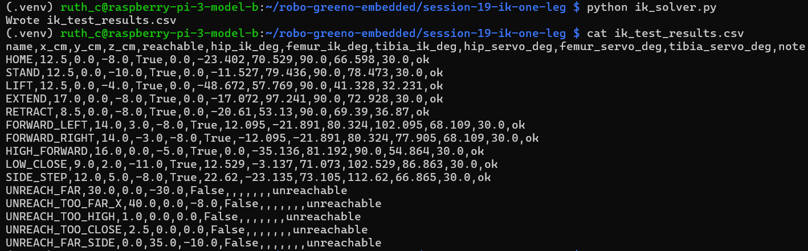
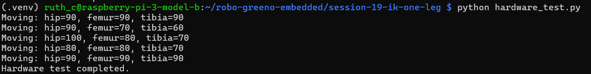
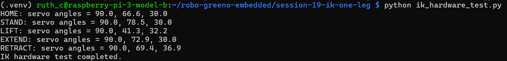

# Session 19 - Inverse Kinematics (IK) One Leg

## Description

Raspberry Pi project implementing inverse kinematics (IK) for a single hexapod robot leg.

This session calculates the required Hip, Femur and Tibia joint angles from a desired foot position `(x, y, z)` using trigonometry, then converts them into calibrated servo angles for the physical leg.

The project also includes hardware verification using three servo motors connected through a PCA9685 PWM controller.

---

## Features

- One-leg inverse kinematics solver
- Trigonometric IK calculations
- Hip angle using `atan2()`
- Femur and tibia angles using the law of cosines
- Reachability detection
- Servo angle mapping with calibration offsets
- Servo angle clamping
- CSV test result generation
- Hardware verification with PCA9685
- Physical three-servo leg testing

---

## Hardware Used

- Raspberry Pi 3 Model B
- PCA9685 Servo Driver
- 3 × MG996R Servo Motors
- External 5V Power Supply

---

## Servo Channels

| Joint | PCA9685 Channel |
|---|---|
| Hip (Coxa) | 0 |
| Femur | 1 |
| Tibia | 2 |

---

## Test Positions

| Position | Foot Target (x, y, z) |
|---|---|
| HOME | (12.5, 0, -8) |
| STAND | (12.5, 0, -10) |
| LIFT | (12.5, 0, -4) |
| EXTEND | (17, 0, -8) |
| RETRACT | (8.5, 0, -8) |
| FORWARD_LEFT | (14, 3, -8) |
| FORWARD_RIGHT | (14, -3, -8) |
| HIGH_FORWARD | (16, 0, -5) |
| LOW_CLOSE | (9, 2, -11) |
| SIDE_STEP | (12, 5, -8) |

---

---

## Demonstration

### IK Solver Output

---

### Hardware Servo Test

---

### IK Hardware Test

---

## Files

session-19-ik-one-leg/
├── README.md
├── ik_solver.py
├── offsets.json
├── ik_test_results.csv
├── servo_test.py
├── hardware_test.py
├── ik_hardware_test.py
├── screenshots/
│   ├── ik_solver_output.png
│   ├── hardware_test.png
│   └── ik_hardware_test.png

---

## Technologies Used

- Python
- Raspberry Pi
- NumPy
- PCA9685
- ServoKit
- I2C
- Inverse Kinematics
- Trigonometry

---

## Verification

Completed tests:

- IK solver verification
- Reachable position testing
- Unreachable position detection
- Servo calibration
- Hardware movement test
- IK hardware integration test

---

## Author

Ruth Cohen

Mentor: Dosithee Miet
