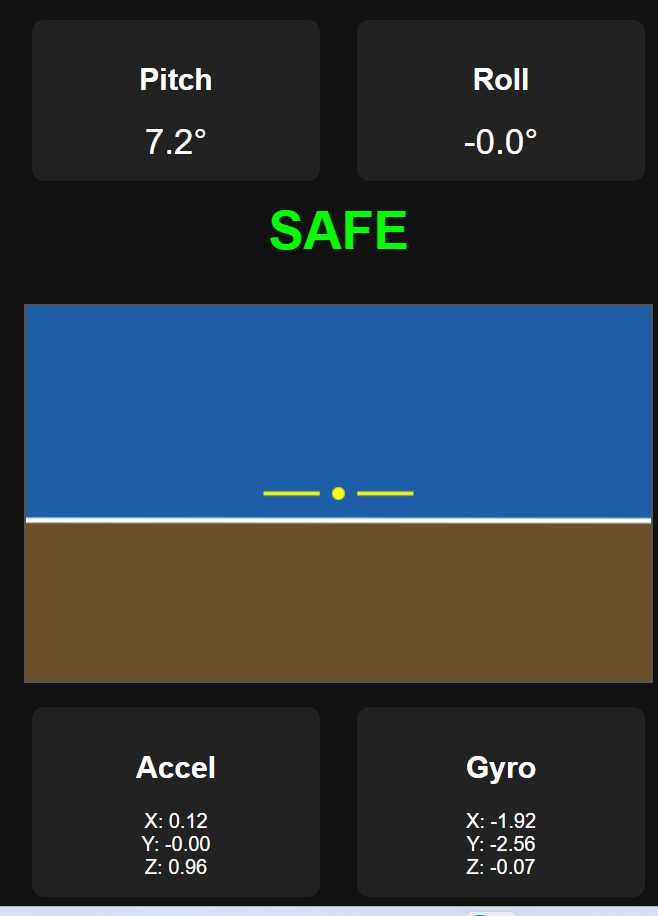

# Session 22 - MPU6050 IMU Balance & Orientation

## Description

Raspberry Pi project demonstrating real-time balance and orientation sensing using the MPU6050 IMU sensor.

The project communicates with the MPU6050 over the I2C bus, reads accelerometer and gyroscope measurements, computes the Pitch and Roll angles, and displays the data both in the terminal and in a real-time web dashboard.

The dashboard provides a live visualization of the sensor orientation together with the current balance status.

---

## Features

- MPU6050 communication over I2C
- Accelerometer data acquisition
- Gyroscope data acquisition
- Pitch and Roll calculation
- Real-time terminal monitoring
- Real-time web dashboard
- Artificial Horizon visualization
- Balance state detection (SAFE / WARNING / DANGER)

---

## Hardware Used

- Raspberry Pi 3 Model B
- MPU6050 (GY-521)
- Jumper Wires

---

## Wiring

| MPU6050 | Raspberry Pi |
|---|---|
| VCC | Pin 1 (3.3V) |
| GND | Pin 6 (GND) |
| SDA | Pin 3 (GPIO2 / SDA) |
| SCL | Pin 5 (GPIO3 / SCL) |

The MPU6050 communicates using the I2C interface.

The default I2C address is:

```text
0x68
```

The connection can be verified using the Raspberry Pi I2C detection utility before running the project.

---

## Required Software

The project requires the following Python libraries:

- Flask
- smbus2

In addition, the Raspberry Pi must have the I2C interface enabled and the I2C system tools installed.

---

## Demonstration

### Real-Time Dashboard



The dashboard displays:

- Pitch angle
- Roll angle
- Accelerometer values (X, Y, Z)
- Gyroscope values (X, Y, Z)
- Artificial Horizon
- Current balance status (SAFE / WARNING / DANGER)

---

## Files

| File | Description |
|---|---|
| `imu_reader.py` | Reads the MPU6050 sensor and prints accelerometer, gyroscope, pitch and roll values to the terminal |
| `imu_web.py` | Starts the real-time web dashboard |
| `screenshots/imu_dashboard.png` | Dashboard screenshot |
| `README.md` | Project documentation |

---

## How to Run

### Terminal Monitoring

Run:

```text
python imu_reader.py
```

The program continuously displays:

- Accelerometer values
- Gyroscope values
- Pitch angle
- Roll angle

---

### Web Dashboard

Run:

```text
python imu_web.py
```

After starting the application, open a web browser and navigate to:

```text
http://<RaspberryPi-IP>:5000
```

The dashboard updates automatically in real time while the sensor is moved.

---

## Technologies Used

- Raspberry Pi
- Python
- MPU6050
- I2C
- Flask
- smbus2
- HTML
- CSS
- JavaScript

---

## Author

Ruth Cohen

Mentor: Dosithee Miet
